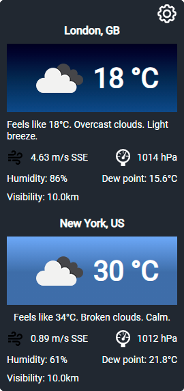

# Weather Widget
Widget shows weather in different cities.
## Stack
React, Typescript/ES7, SCSS

## Development
Create .env file in root directory   
```
REACT_APP_API_KEY=YOUR_API_KEY
```
To start local development server run  
`yarn start`   
To build app for production use:    
`yarn build`

## Setup
First of all, build app (take javascript and image files) . Put it in any directory, and add the following to your `.html` file,
in which you want to include the widget.

```html
    <weather-widget></weather-widget>
    <!-- OR -->
    <div id="weather-widget"></div>
    <script type="text/javascript" src="pathtofile/weather.js"></script>
```

Wow! You are breathtaking!

**Notice:** you could use any of `weather-widget` or `div`, but div browsers support is better than custom tags :)


## Screenshots


## TODO
- [x] Visual Concept
- [ ] Settings
- [ ] Save to Local storage